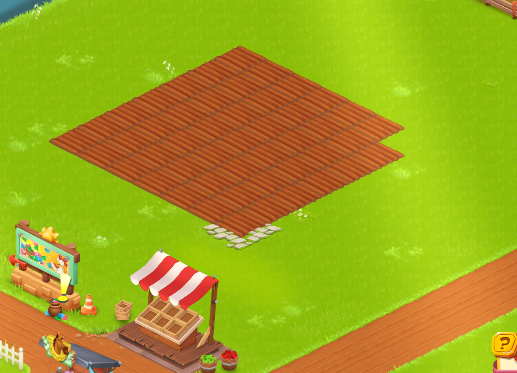

  <h1>🌾 HFB — Hay Day Auto-Farming Bot</h1>
  
<strong>A fully autonomous, intelligent farming assistant for Hay Day</strong>

  
  
  
  

 

HFB is a robust, production-ready Windows application that fully automates the agricultural lifecycle in Hay Day. It utilizes advanced computer vision (OpenCV scale-invariant template matching) and low-level device interaction (ADB + minitouch) via MuMu Player to seamlessly plant, harvest, and sell crops infinitely.

---

## ✨ Features

- **🎮 All-in-One Standalone Application**: Built into a single `.exe` file with a sleek dark-themed GUI. No Python installation, ADB setup, or command-line experience required.
- **🔄 Infinite Master Loop**: Autonomously cycles through Planting ➔ Harvesting ➔ Selling.
- **🏗️ Resilient Error Handling & Crash Recovery**: If the game crashes, gets stuck, or the cycle fails 3 times, the bot automatically handles ADB restarts, re-launches the game, dismisses daily popups, and realigns the camera via a custom pinch-to-zoom injection.
- **💰 Smart Selling & "Silo Full" Handling**: When the silo hits maximum capacity, the bot instantly diverts to the Roadside Shop, sells inventory, occasionally clicks ads, and safely waits before resuming the harvest.
- **🧭 Dynamic Vision System**: Uses scale-invariant template matching to locate exact UI elements dynamically. The camera can move, but the bot will find what it needs.
- **⚡ Background Execution**: The core processing and ADB commands run entirely in the background without stealing your mouse or launching annoying terminal windows.

## 🚀 Quick Start (For Users)

**⚠️ IMPORTANT: You MUST read these instructions carefully before using the bot!**

The easiest way to use the bot is to download the standalone `.exe` release from the **GitHub Releases** section.

### Prerequisites & In-Game Setup
1. **MuMu Player**: You must use MuMu Player (Android Emulator) to run Hay Day.
2. **Resolution & Settings**: 
   - Ensure the emulator resolution provides a clear view of the farm. 
   - The bot connects to the default MuMu port: `127.0.0.1:7555`.
3. **Farm Decoration Setup (CRITICAL)**: 
   Before starting the bot, you **MUST** add two specific decorations to your land: a **"Heart Topiary"** and a **"Stone Path"**. 
   - These decorations must be placed **exactly** where the pictures below show.
   - The area around these decorations in the pictures **must be clean**.
   
   

     
      <em>Picture 1: Required decoration setup.</em>
   

   

     
      <em>Picture 2: Required decoration setup.</em>
   

4. **Crop Status**: Wait until your crops are empty and you are ready to plant Wheat.

### Running the App
1. Download `HFB.exe` from the GitHub **Releases** section.
2. Extract the files if necessary, and double-click the application to launch the GUI.
3. Verify your Hay Day game is open and running in MuMu Player.
4. Click **▶ Start Bot**. The bot will start working immediately. The live log panel will display the connection status and progress.
5. Click **■ Stop Bot** at any time to instantly lock the logic and halt the bot safely.
---

  Built with ❤️ by the community.

