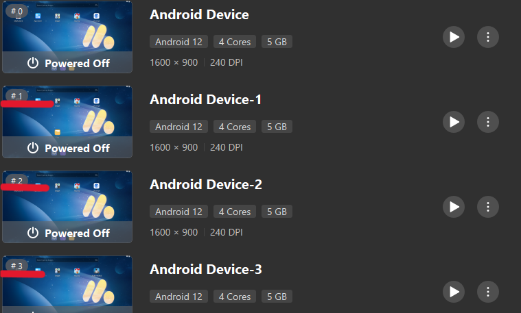

## 🚀 Quick Start

**⚠️ IMPORTANT: Read these instructions carefully before using the bot!**

The easiest way to use the bot is to download the standalone `.exe` release from the **GitHub Releases** section.

### Prerequisites & In-Game Setup
1. **MuMu Player**: Use MuMu Player (Android emulator) to run Hay Day.
   Download link: https://www.mumuplayer.com/download/
2. The bot can work on 3 devices. In MuMu Player, each instance shows a number with a hashtag, such as `#1`, `#2`, `#3`. The bot only works with these instances. `#1` is the first device in the HFB application, `#2` is the second device, and `#3` is the third device.
   

     
      <em>Picture 3: Device instances labeled #1, #2, #3.</em>
   

3. **Farm Decoration Setup (CRITICAL)**:
   Before starting the bot, you **MUST** add two specific decorations to your land: a **"Heart Topiary"** and a **"Stone Path"**.
   - Place these decorations **exactly** where the pictures show.
   - The area around these decorations in the pictures **must be clean**.
   
   

     
      <em>Picture 1: Required decoration setup.</em>
   

   

     
      <em>Picture 2: Required decoration setup.</em>
   

4. **Crop Status**: Remove all crops except wheat. The best practice is to keep twice as much wheat as your land size. For example, if your land is 20, keep 40 wheat.
5. **Silo Storage**: Keep around 225 to 275 silo storage. This helps avoid silo-full errors. The bot can handle some variance, but keeping at least 225 is better.
6. **Shop Slots**: For best results, use 10 shop slots.
7. **Land Limit**: Maximum land allowed is 49. This is the optimal size for the bot.

### Running the App
1. Download `HFB.exe` from the GitHub **Releases** section.
2. Extract the files if necessary, and double-click the application to launch the GUI.
3. Do not open Hay Day directly; only open the Hay Day instance in MuMu Player.
4. Click **▶ Start Bot**. The bot will start working immediately. The live log panel will display the connection status and progress.
5. Click **■ Stop Bot** at any time to halt the bot safely.
---

<i>This is an experimental project. It may make mistakes, and using this application may carry a risk of being banned by Supercell.</i>
